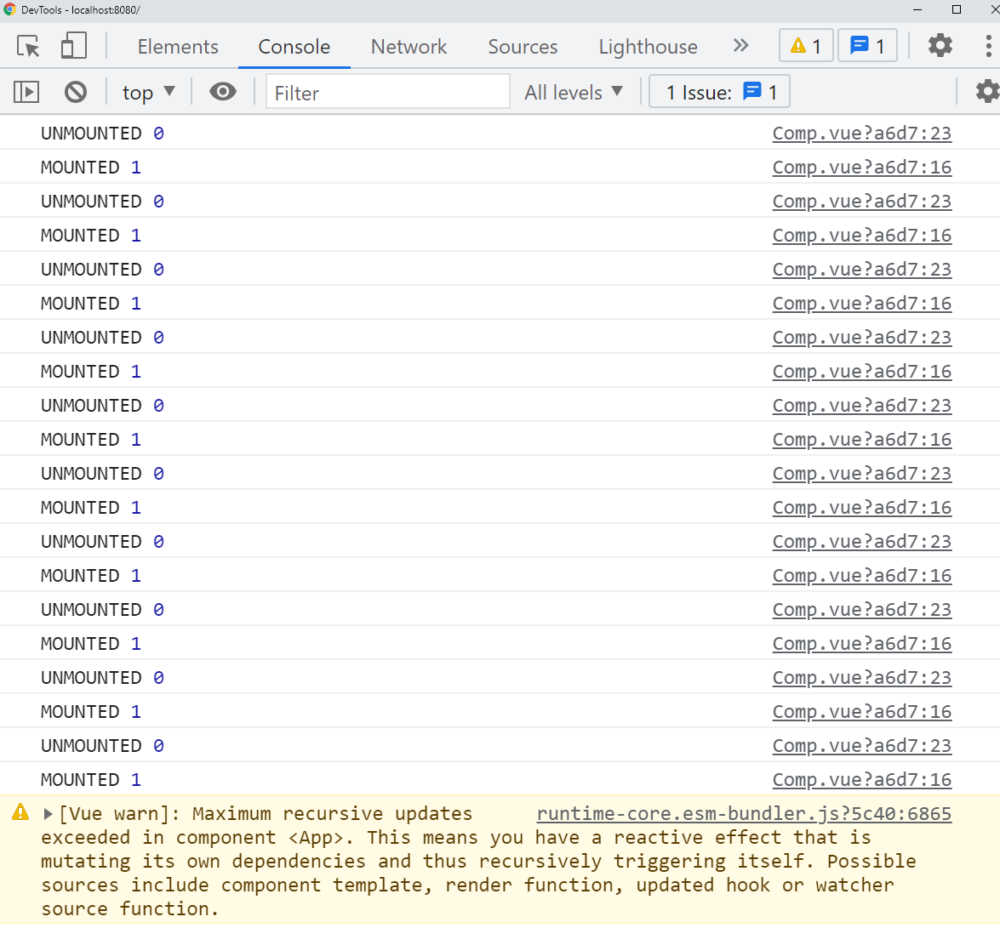

# Vue Bug Repro

If you run the development server using:

```
yarn serve
```

Then, have the `Comp` file refresh your development environment by commenting out (or uncommenting) line 18
in [`src/Comp.vue`](src/Comp.vue#L18).

You will then be faced with the following error.



> Maximum recursive updates exceeded in component <App>. This means you have a reactive effect that is mutating its own dependencies and thus recursively triggering itself. Possible sources include component template, render function, updated hook or watcher source function.

While I originally thought this was a mistake in how I perceived `onScopeDisposal`'s usage (and this is still possible),
this issue does not seem to persist if you copy+paste the `setup()` function to `App.vue`. 

Further, if you update `onScopeDisposal` to be `onUnmounted`, this error also does not persist.

This bug was tested against Vue CLI 5 as well, which does not seem to have a different effect on the usage.
